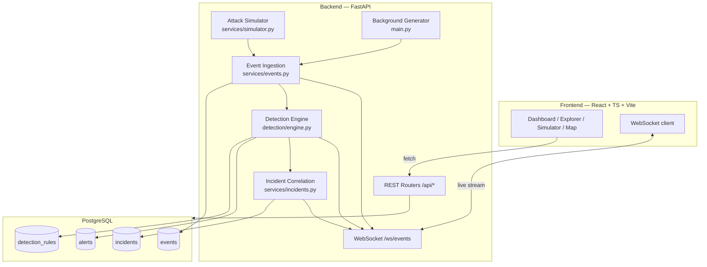
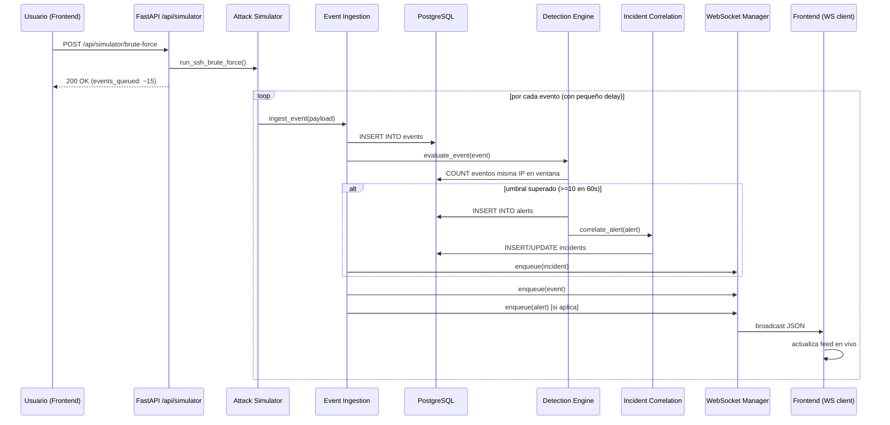

# 01 — Arquitectura

## Visión general
Gravity SIEM sigue una arquitectura de tres capas clásica (frontend /
API / datos), con dos productores de eventos (el generador de fondo y
el simulador de ataques) que convergen en un único punto de ingesta,
y un pipeline de procesamiento síncrono: **evento → detección →
alerta → correlación → incidente**, difundido en tiempo real por
WebSocket.

## Componentes
| Componente | Responsabilidad | Archivo |
|---|---|---|
| **Event Ingestion** | Punto único de entrada para cualquier evento (simulado o de fondo). Persiste, dispara detección y correlación, y notifica por WebSocket | `backend/app/services/events.py` |
| **Detection Engine** | Evalúa cada evento contra las reglas activas y crea alertas al superar el umbral | `backend/app/detection/engine.py` |
| **Rule Catalog** | Definición declarativa de las 7 reglas (umbral, ventana, severidad, técnica MITRE) | `backend/app/detection/rules.py` |
| **Incident Correlation** | Agrupa alertas relacionadas (misma IP + técnica + ventana temporal) en incidentes | `backend/app/services/incidents.py` |
| **Attack Simulator** | Genera ráfagas de eventos sintéticos que imitan cada tipo de ataque | `backend/app/services/simulator.py` |
| **Background Generator** | Genera eventos benignos aleatorios cada 2-5s para mantener el feed vivo | `backend/app/main.py` |
| **WebSocket Manager** | Cola asíncrona + fan-out a todos los clientes conectados | `backend/app/services/websocket_manager.py` |
| **API Layer (frontend)** | Único punto de llamadas HTTP/WS, parametrizado por variables de entorno | `frontend/src/api.ts`, `frontend/src/ws.ts` |

## Flujo de datos end-to-end
Ejemplo: el usuario pulsa "SSH Brute Force" en el simulador.

## Separación frontend/backend
El frontend nunca importa nada específico del backend: toda
comunicación pasa por dos módulos (`api.ts` para REST, `ws.ts` para el
socket), configurados vía `VITE_API_URL` y `VITE_WS_URL`. Esto permite
en el futuro desplegar el frontend de forma estática (GitHub Pages) y
apuntar a un backend en otra URL — ver
[08-deployment.md](./08-deployment.md).

## Por qué esta arquitectura
- **Un único funnel de ingesta** (`ingest_event`): tanto el generador
  de fondo como el simulador de ataques pasan por la misma función,
  así que el motor de detección nunca sabe (ni necesita saber) de
  dónde vino el evento — se comporta igual con tráfico "real" simulado
  y con ataques simulados.
- **Reglas declarativas separadas del motor**: añadir una regla nueva
  (`detection/rules.py`) no requiere tocar la lógica de evaluación
  (`detection/engine.py`).
- **Correlación desacoplada de la detección**: el motor solo crea
  alertas; la decisión de agruparlas en incidentes vive en su propio
  servicio, lo que facilita cambiar la estrategia de correlación sin
  tocar las reglas.