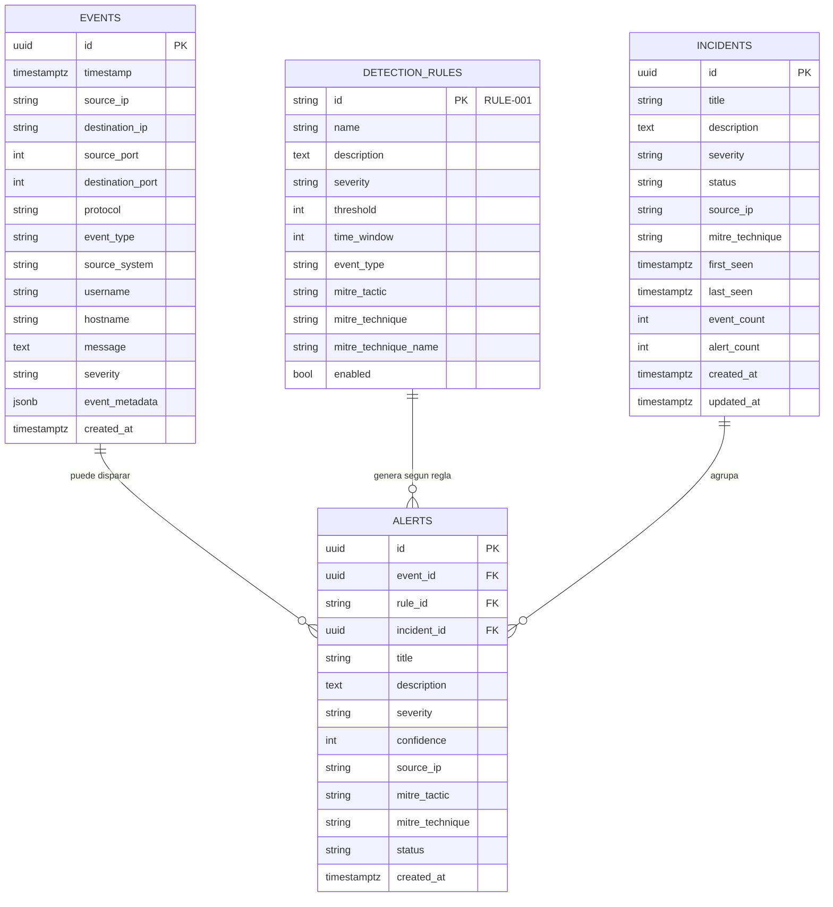

# 02 — Base de datos
PostgreSQL es la única fuente de verdad. Cuatro tablas cubren todo el
ciclo de vida: `events` → `alerts` → `incidents`, más el catálogo de
`detection_rules`.

## Diagrama entidad-relación


## Detalle de tablas
### `events`
Cada fila es un log normalizado, independientemente de su origen
(generador de fondo o simulador). `event_metadata` es `JSONB` para
guardar campos variables según el tipo de evento (p. ej. el payload
de una inyección SQL simulada).

```sql
CREATE TABLE events (
    id UUID PRIMARY KEY,
    timestamp TIMESTAMPTZ NOT NULL,
    source_ip VARCHAR(45) NOT NULL,
    destination_ip VARCHAR(45),
    source_port INTEGER,
    destination_port INTEGER,
    protocol VARCHAR(20),
    event_type VARCHAR(50) NOT NULL,
    source_system VARCHAR(50) NOT NULL DEFAULT 'unknown',
    username VARCHAR(100),
    hostname VARCHAR(100),
    message TEXT,
    severity VARCHAR(20) NOT NULL DEFAULT 'LOW',
    event_metadata JSONB NOT NULL DEFAULT '{}',
    created_at TIMESTAMPTZ NOT NULL DEFAULT now()
);

CREATE INDEX ix_events_timestamp ON events (timestamp);
CREATE INDEX ix_events_source_ip ON events (source_ip);
CREATE INDEX ix_events_event_type ON events (event_type);
CREATE INDEX ix_events_severity ON events (severity);
CREATE INDEX ix_events_timestamp_source_ip ON events (timestamp, source_ip);
```

El índice compuesto `(timestamp, source_ip)` es el que más se usa: es
exactamente el patrón de consulta del motor de detección ("cuántos
eventos de este tipo tiene esta IP en los últimos N segundos").

### `detection_rules`
Tabla de configuración, sembrada al arrancar desde
`detection/rules.py`. El único campo mutable en runtime es `enabled`
(vía `PATCH /api/rules/{id}`).

### `alerts`
Una alerta referencia el evento que la disparó (`event_id`), la regla
que la generó (`rule_id`) y, una vez correlacionada, el incidente al
que pertenece (`incident_id`, nulo hasta que `correlate_alert()` la
asigna).

```sql
CREATE TABLE alerts (
    id UUID PRIMARY KEY,
    event_id UUID REFERENCES events(id),
    rule_id VARCHAR(20) NOT NULL REFERENCES detection_rules(id),
    incident_id UUID REFERENCES incidents(id),
    title VARCHAR(200) NOT NULL,
    description TEXT NOT NULL,
    severity VARCHAR(20) NOT NULL,
    confidence INTEGER NOT NULL DEFAULT 70,
    source_ip VARCHAR(45) NOT NULL,
    mitre_tactic VARCHAR(100) NOT NULL,
    mitre_technique VARCHAR(20) NOT NULL,
    status VARCHAR(20) NOT NULL DEFAULT 'NEW',
    created_at TIMESTAMPTZ NOT NULL DEFAULT now()
);

CREATE INDEX ix_alerts_severity ON alerts (severity);
CREATE INDEX ix_alerts_source_ip ON alerts (source_ip);
CREATE INDEX ix_alerts_created_at ON alerts (created_at);
```

### `incidents`
Agregado de alertas relacionadas. `event_count`/`alert_count` se
incrementan en cada correlación; `last_seen` se actualiza para que la
ventana de correlación (ver
[04-incident-correlation.md](./04-incident-correlation.md)) se calcule
sobre la actividad más reciente del incidente, no sobre su creación.

Estados válidos: `OPEN`, `INVESTIGATING`, `CONTAINED`, `RESOLVED`,
`FALSE_POSITIVE`.

## Por qué JSONB para metadata
Cada tipo de evento tiene campos propios (una inyección SQL guarda
`payload` y `path`; una detección de malware guarda `signature` y
`file_hash`). En vez de crear columnas dispersas o una tabla EAV,
`event_metadata JSONB` guarda esa información variable sin perder la
capacidad de indexarla o consultarla con operadores JSON de Postgres
si en el futuro hiciera falta (`event_metadata->>'payload'`).

## Migraciones
El proyecto usa `Base.metadata.create_all()` (SQLAlchemy) al arrancar,
sin herramienta de migraciones formal (Alembic) — adecuado para un
proyecto de portfolio de un solo entorno. Si el esquema evoluciona en
producción, la recomendación en el roadmap es introducir Alembic para
versionar cambios.