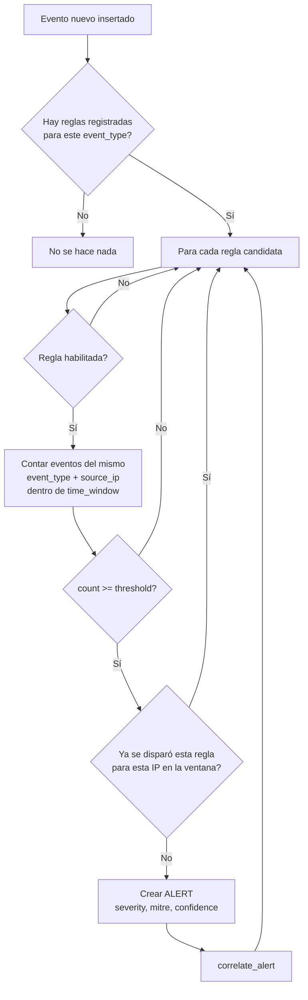

# 03 — Motor de Detección

## Concepto
El motor es **genérico y guiado por datos**: no tiene ningún `if
event_type == "AUTH_FAILURE"` hardcodeado. En su lugar, cada regla
declara a qué `event_type` reacciona, y el motor aplica siempre la
misma lógica de "contar eventos similares de la misma IP dentro de
una ventana temporal y comparar contra un umbral".



## Catálogo de reglas
Definido en `backend/app/detection/rules.py` como una lista de
`RuleDefinition` (dataclass inmutable). Cada regla es independiente y
autocontenida:

```python
RuleDefinition(
    id="RULE-001",
    name="SSH Brute Force",
    severity="HIGH",
    threshold=10,
    time_window=60,          # segundos
    event_type="AUTH_FAILURE",
    mitre_tactic="Credential Access",
    mitre_technique="T1110",
    mitre_technique_name="Brute Force",
    alert_title="SSH Brute Force Attack Detected",
)
```

| ID | Nombre | event_type | Umbral | Ventana | Severidad | MITRE |
|---|---|---|---|---|---|---|
| RULE-001 | SSH Brute Force | `AUTH_FAILURE` | 10 | 60s | HIGH | T1110 |
| RULE-002 | Port Scanning | `PORT_SCAN` | 15 | 60s | MEDIUM | T1046 |
| RULE-003 | SQL Injection | `SQL_INJECTION` | 5 | 120s | CRITICAL | T1190 |
| RULE-004 | XSS Attempt | `XSS_ATTEMPT` | 5 | 120s | HIGH | T1190 |
| RULE-005 | Multiple Failed Logins | `WEB_AUTH_FAILURE` | 5 | 90s | MEDIUM | T1110.001 |
| RULE-006 | Suspicious Malware Detection | `MALWARE_DETECTED` | 1 | 1s | CRITICAL | T1204 |
| RULE-007 | Potential DDoS | `NETWORK_FLOOD` | 100 | 30s | CRITICAL | T1498 |

Al arrancar, `seed.py` inserta estas 7 reglas en `detection_rules`
(idempotente: si ya existen, no las duplica). El campo `enabled` vive
solo en base de datos, así que activar/desactivar una regla desde el
frontend (`PATCH /api/rules/{id}`) no requiere reiniciar el backend.

## Añadir una regla nueva
No hace falta tocar `engine.py`. Basta con:

1. Añadir un `RuleDefinition` nuevo en `detection/rules.py`.
2. Reiniciar el backend (o esperar al siguiente arranque) para que
   `seed_rules()` la inserte en base de datos.

```python
RuleDefinition(
    id="RULE-008",
    name="Unusual Outbound Data Transfer",
    severity="MEDIUM",
    threshold=50,
    time_window=300,
    event_type="LARGE_UPLOAD",
    mitre_tactic="Exfiltration",
    mitre_technique="T1041",
    mitre_technique_name="Exfiltration Over C2 Channel",
    alert_title="Possible Data Exfiltration Detected",
)
```

## Anti-duplicados (cooldown)
Sin protección, una ráfaga de 200 eventos que supera un umbral de 10
generaría ~190 alertas idénticas. `_rule_recently_fired()` comprueba
si ya existe una alerta de esa regla para esa IP dentro de la misma
ventana temporal; si es así, no crea una nueva. El resultado: **una
alerta por ráfaga**, no una por evento.

```python
def _rule_recently_fired(db, rule_id, source_ip, window_start) -> bool:
    stmt = select(Alert.id).where(
        Alert.rule_id == rule_id,
        Alert.source_ip == source_ip,
        Alert.created_at >= window_start,
    ).limit(1)
    return db.execute(stmt).first() is not None
```

## Cálculo de confianza
`confidence = min(99, 60 + matching_count)` — cuantos más eventos por
encima del umbral, mayor confianza, con un techo en 99%. Es una
heurística simple, no un modelo de ML.

## Rendimiento
La consulta de conteo (`COUNT(*) WHERE event_type=... AND
source_ip=... AND timestamp BETWEEN ...`) se apoya directamente en el
índice compuesto `ix_events_timestamp_source_ip` — ver
[02-database.md](./02-database.md).