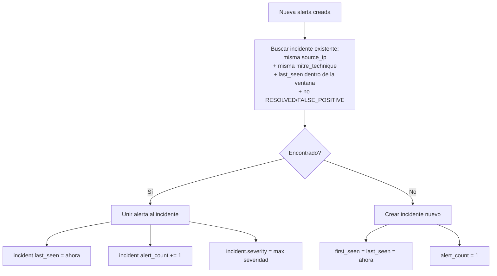
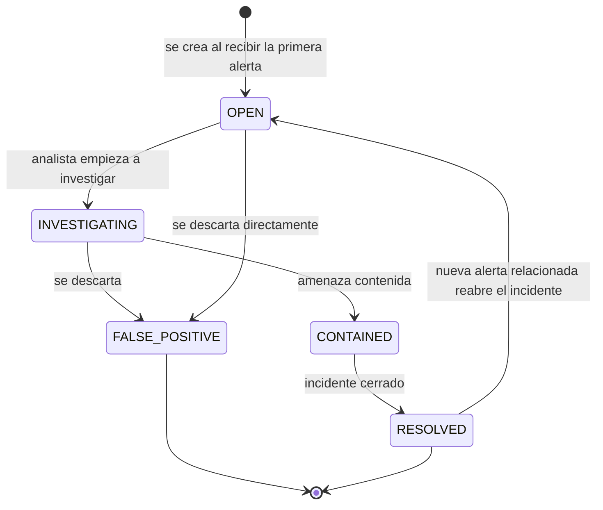

# 04 — Correlación de Incidentes

## Por qué correlacionar
Sin correlación, cada alerta generaría un incidente independiente. En
una ráfaga real de ataque (p. ej. un brute force que dispara varias
alertas mientras continúa), eso produciría decenas de incidentes
idénticos en vez de uno solo con todo el contexto agrupado.

## Regla de correlación
Dos alertas se agrupan en el mismo incidente si comparten:

1. La **misma `source_ip`**.
2. La **misma `mitre_technique`**.
3. Ocurren dentro de la **ventana de correlación** (por defecto 300s,
   configurable vía `INCIDENT_CORRELATION_WINDOW_SECONDS`), medida
   desde el `last_seen` del incidente candidato — no desde su
   creación, así un incidente activo puede "vivir" indefinidamente
   mientras siga recibiendo alertas relacionadas.



## Diagrama de estados de un incidente


Nota: si llega una alerta nueva que coincide con un incidente en
`RESOLVED`, el sistema lo reabre automáticamente (`status = "OPEN"`) en
lugar de crear uno duplicado — ver `correlate_alert()` en
`backend/app/services/incidents.py`.

## Código clave
```python
def correlate_alert(db: Session, alert: Alert) -> Incident:
    window_start = alert.created_at - timedelta(
        seconds=settings.incident_correlation_window_seconds
    )

    incident = db.execute(
        select(Incident).where(
            Incident.source_ip == alert.source_ip,
            Incident.mitre_technique == alert.mitre_technique,
            Incident.last_seen >= window_start,
            Incident.status.not_in(["RESOLVED", "FALSE_POSITIVE"]),
        ).order_by(Incident.last_seen.desc()).limit(1)
    ).scalar_one_or_none()

    if incident is None:
        incident = Incident(..., status="OPEN", alert_count=1, event_count=1)
        db.add(incident)
    else:
        incident.last_seen = alert.created_at
        incident.severity = max(incident.severity, alert.severity)
        incident.alert_count += 1
        incident.event_count += 1

    alert.incident_id = incident.id
    return incident
```

## Ejemplo práctico
Un ataque de fuerza bruta SSH desde `185.220.12.42` genera 3 alertas
`RULE-001` en 4 minutos (porque el atacante hace pausas entre ráfagas).
Las tres comparten IP y técnica `T1110`, y están dentro de la ventana
de 5 minutos entre sí → **un solo incidente** con `alert_count = 3`.

Si diez minutos después la misma IP dispara una alerta de **port
scan** (`T1046`, técnica distinta), se crea un **incidente nuevo**,
porque la técnica no coincide — un port scan y un brute force son
actividades diferentes aunque vengan del mismo atacante.

## Limitaciones conocidas (documentadas honestamente)
- La correlación es solo por `source_ip` + `mitre_technique`; no
  detecta campañas del mismo atacante usando IPs rotativas ni agrupa
  técnicas relacionadas de tácticas distintas.
- No hay deduplicación de incidentes si dos procesos concurrentes
  compiten por crear el "primer" incidente de una ráfaga (edge case
  de baja probabilidad dado el volumen de este proyecto).

Ambas quedan anotadas en el [Roadmap](../README.md#roadmap--mejoras-futuras)
como mejoras futuras.