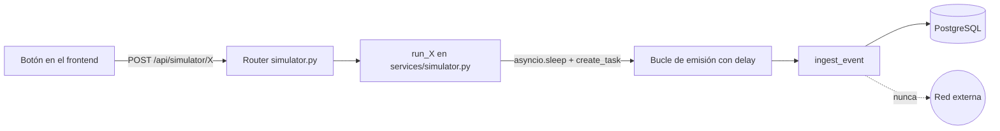

# 05 — Attack Simulator

## Garantía de seguridad
**Ninguna función de `backend/app/services/simulator.py` abre un
socket, hace una petición HTTP real, ejecuta SQL dinámico, ni toca
nada fuera de este contenedor.** Cada "ataque" es una función async
que construye entre 1 y ~140 diccionarios Python con forma de log
realista y los pasa a `ingest_event()` — la misma función que procesa
el tráfico benigno de fondo. El resultado son filas en PostgreSQL, no
tráfico de red.



## Catálogo de ataques simulados
| Endpoint | Evento generado | Volumen | Dispara |
|---|---|---|---|
| `POST /api/simulator/brute-force` | `AUTH_FAILURE` (SSH, puerto 22) desde una IP externa aleatoria | 12–20 eventos, delay 0.4s | RULE-001 |
| `POST /api/simulator/port-scan` | `PORT_SCAN` a 22 puertos aleatorios distintos | 22 eventos, delay 0.3s | RULE-002 |
| `POST /api/simulator/sql-injection` | `SQL_INJECTION` con payload simulado (`' OR 1=1 --`, `UNION SELECT`, etc.) en `metadata.payload` | 6–9 eventos, delay 0.5s | RULE-003 |
| `POST /api/simulator/xss` | `XSS_ATTEMPT` con payload simulado (`<script>alert(1)</script>`, etc.) | 6–9 eventos, delay 0.5s | RULE-004 |
| `POST /api/simulator/suspicious-login` | `WEB_AUTH_FAILURE` para usuario `admin` desde varias IPs distintas | 6–8 eventos, delay 0.6s | RULE-005 |
| `POST /api/simulator/malware` | `MALWARE_DETECTED` con firma y hash simulados | 1 evento | RULE-006 |
| `POST /api/simulator/ddos` | `NETWORK_FLOOD` desde 4 IPs rotativas | 110–140 eventos, delay 0.08s | RULE-007 |

## Ejemplo de código: SQL Injection simulada
```python
SQLI_PAYLOADS = [
    "' OR 1=1 --",
    "' OR '1'='1",
    "1; DROP TABLE users;",
    "' UNION SELECT username, password FROM users --",
    "admin'--",
]

async def run_sql_injection(db_factory) -> int:
    attacker = random.choice(EXTERNAL_ATTACK_IPS)
    count = random.randint(6, 9)
    for i in range(count):
        payload_str = random.choice(SQLI_PAYLOADS)
        payload = _base_payload(
            source_ip=attacker,
            event_type="SQL_INJECTION",
            message=f"Suspicious query parameter detected: {payload_str}",
            metadata={"payload": payload_str, "path": "/api/search"},
        )
        asyncio.create_task(_emit(db_factory, payload, delay=i * 0.5))
    return count
```

Nótese que `payload_str` nunca se ejecuta ni se interpola en una
consulta SQL real: se guarda como **texto plano** dentro de
`event_metadata`, exactamente igual que un WAF real registraría el
patrón detectado en un log, sin ejecutar el ataque.

## Por qué el delay progresivo
Cada evento se emite con un pequeño retraso (`asyncio.create_task` +
`asyncio.sleep`) en lugar de insertarse todo de golpe. Esto es
intencional: permite que el usuario **vea** en el Dashboard y en el
Live Event Stream cómo los eventos van llegando uno a uno hasta que el
motor de detección cruza el umbral y dispara la alerta — el objetivo
pedagógico del simulador.

## IPs y ubicaciones
Las IPs "atacantes" (`EXTERNAL_ATTACK_IPS`, en
`services/geo.py`) son una lista fija de direcciones de ejemplo
(rangos documentales/reservados y de prueba), cada una asociada a una
ubicación de latitud/longitud **fija y ficticia** para el mapa — nunca
se realiza una consulta de geolocalización real. Ver
[02-database.md](./02-database.md) y `services/geo.py` para la tabla
completa.