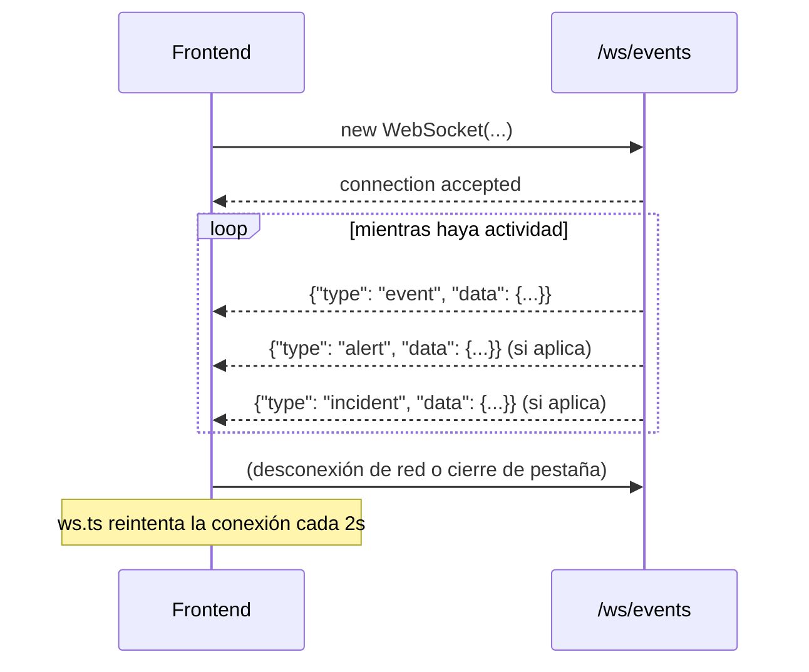

# 06 — Referencia de API
Documentación interactiva autogenerada (OpenAPI/Swagger) disponible en
`http://localhost:8000/docs` mientras el backend está corriendo. Esta
página es la referencia legible en texto plano.

## Eventos
### `GET /api/events`
Lista paginada con filtros.

| Query param | Tipo | Descripción |
|---|---|---|
| `severity` | string | `LOW`\|`MEDIUM`\|`HIGH`\|`CRITICAL` |
| `event_type` | string | p. ej. `AUTH_FAILURE` |
| `source_ip` | string | coincidencia parcial |
| `search` | string | busca en `message` |
| `date_from` / `date_to` | ISO datetime | rango de fechas |
| `sort` | string | `timestamp_desc` (default) \| `timestamp_asc` \| `severity` |
| `page` / `page_size` | int | paginación (`page_size` máx. 200) |

```json
// GET /api/events?severity=HIGH&page=1&page_size=2
{
  "items": [
    {
      "id": "3fa85f64-5717-4562-b3fc-2c963f66afa6",
      "timestamp": "2026-08-16T15:42:31Z",
      "source_ip": "185.220.12.42",
      "destination_ip": "192.168.1.10",
      "destination_port": 22,
      "protocol": "SSH",
      "event_type": "AUTH_FAILURE",
      "source_system": "auth_server",
      "username": "admin",
      "severity": "LOW",
      "event_metadata": {},
      "created_at": "2026-08-16T15:42:31Z"
    }
  ],
  "total": 812,
  "page": 1,
  "page_size": 2
}
```

### `GET /api/events/{id}`
Devuelve un evento individual completo (incluye `event_metadata`
JSON), usado por el modal de detalle en Event Explorer.

## Alertas
| Endpoint | Descripción |
|---|---|
| `GET /api/alerts?severity=&status=&limit=` | Lista de alertas, más recientes primero |
| `GET /api/alerts/{id}` | Detalle de una alerta |

## Incidentes
| Endpoint | Descripción |
|---|---|
| `GET /api/incidents?status=&severity=&limit=` | Lista de incidentes |
| `GET /api/incidents/{id}` | Detalle + `timeline` + `alerts` relacionadas |
| `PATCH /api/incidents/{id}` | Cambia `status` (ver valores válidos abajo) |

```json
// PATCH /api/incidents/{id}
{ "status": "INVESTIGATING" }
```

Valores válidos: `OPEN`, `INVESTIGATING`, `CONTAINED`, `RESOLVED`,
`FALSE_POSITIVE`. Un valor distinto devuelve `400 Bad Request`.

## Reglas de detección
| Endpoint | Descripción |
|---|---|
| `GET /api/rules` | Lista las 7 reglas con su configuración |
| `PATCH /api/rules/{id}` | `{ "enabled": false }` — activa/desactiva |

## Estadísticas (Dashboard)
### `GET /api/stats`
```json
{
  "total_events": 1543,
  "active_alerts": 12,
  "critical_alerts": 3,
  "open_incidents": 4,
  "events_per_minute": 6.0,
  "severity_breakdown": { "LOW": 900, "MEDIUM": 400, "HIGH": 200, "CRITICAL": 43 },
  "event_type_breakdown": { "AUTH_FAILURE": 300, "PORT_SCAN": 120 },
  "top_sources": [{ "source_ip": "185.220.12.42", "count": 88 }],
  "threat_activity": [{ "timestamp": "2026-08-16T15:40:00Z", "events": 12, "threats": 2 }]
}
```

`threat_activity` agrupa eventos en buckets de 5 minutos sobre las
últimas 2 horas — es la serie que alimenta el gráfico de área del
Dashboard.

## MITRE ATT&CK
### `GET /api/mitre`
Devuelve una entrada por cada técnica presente en el catálogo de
reglas, con el conteo de alertas reales generadas hasta el momento.

## Mapa de amenazas
### `GET /api/map/sources`
Agrega alertas por `source_ip` y las cruza con la tabla de
localización simulada (`services/geo.py`), devolviendo lat/lng/país
para pintar el mapa Leaflet.

## Attack Simulator
Todos son `POST`, sin body, devuelven `202`-like payload (aunque el
código HTTP es `200`) con el número de eventos encolados:

```
POST /api/simulator/brute-force
POST /api/simulator/port-scan
POST /api/simulator/sql-injection
POST /api/simulator/xss
POST /api/simulator/suspicious-login
POST /api/simulator/malware
POST /api/simulator/ddos
```

```json
{
  "attack": "SSH Brute Force",
  "events_queued": 17,
  "message": "Simulacion 'SSH Brute Force' iniciada: 17 eventos simulados se generaran progresivamente. Ningun trafico real ha sido enviado."
}
```

## WebSocket
### `WS /ws/events`
Conexión persistente, sin autenticación (proyecto local/educativo). El
servidor empuja mensajes; el cliente no necesita enviar nada (el
`receive_text()` del backend solo detecta desconexiones).

Formato de mensaje — un sobre `{ type, data }`:

```json
{ "type": "event", "data": { "id": "...", "event_type": "AUTH_FAILURE", "...": "..." } }
{ "type": "alert", "data": { "id": "...", "title": "SSH Brute Force Attack Detected", "...": "..." } }
{ "type": "incident", "data": { "id": "...", "alert_count": 3, "...": "..." } }
```



El cliente (`frontend/src/ws.ts`) reconecta automáticamente cada 2
segundos si la conexión se cae, y expone el estado `connected` que el
Layout usa para el indicador LIVE/DISCONNECTED.

## Salud
### `GET /api/health`
```json
{ "status": "ok", "simulation_mode": true }
```

Usado por el `healthcheck` de Docker Compose del servicio `backend`.