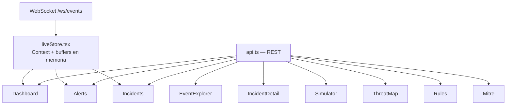

# 07 — Frontend

## Estructura
```
frontend/src/
├── api.ts            # única capa de llamadas REST (lee VITE_API_URL)
├── ws.ts              # hook de bajo nivel para el WebSocket (lee VITE_WS_URL)
├── liveStore.tsx      # contexto React: buffers de eventos/alertas/incidentes en vivo
├── types.ts            # tipos TS espejo de los schemas Pydantic del backend
├── App.tsx              # definición de rutas
├── components/
│   ├── Layout.tsx        # sidebar + topbar + indicador LIVE
│   ├── GravityMark.tsx    # logo textual/iconográfico
│   ├── SeverityBadge.tsx
│   ├── StatusBadge.tsx
│   ├── StatCard.tsx
│   └── Panel.tsx
└── pages/
    ├── Dashboard.tsx
    ├── EventExplorer.tsx
    ├── Alerts.tsx
    ├── Incidents.tsx
    ├── IncidentDetail.tsx
    ├── Simulator.tsx
    ├── ThreatMap.tsx
    ├── Rules.tsx
    └── Mitre.tsx
```

## Flujo de datos en el cliente


`liveStore.tsx` mantiene un único socket abierto para toda la app
(no uno por página) y expone tres buffers (`liveEvents`,
`liveAlerts`, `liveIncidents`, máx. 200 elementos cada uno) vía
contexto React. Las páginas que necesitan datos históricos completos
(Event Explorer, Rules, MITRE) los piden por REST; las que necesitan
la sensación de "en vivo" (Dashboard, Alerts, Incidents) combinan REST
inicial + el buffer en vivo.

## Capa de API — por qué existe
Ninguna página importa `fetch` directamente. Todo pasa por
`api.ts`:

```typescript
export const API_URL = import.meta.env.VITE_API_URL ?? "http://localhost:8000";

export const api = {
  stats: () => request<Stats>("/api/stats"),
  events: (filters) => request<EventsPage>(`/api/events${toQuery(filters)}`),
  simulate: (attack) => request(`/api/simulator/${attack}`, { method: "POST" }),
  // ...
};
```

Esto es lo que permite, sin tocar ninguna página, cambiar dónde vive
el backend simplemente reconfigurando `VITE_API_URL` — ver
[08-deployment.md](./08-deployment.md#preparación-para-github-pages).

## Páginas
| Página | Ruta | Qué muestra |
|---|---|---|
| Dashboard | `/` | Métricas top, gráfico de actividad (Recharts), severidad, alertas/incidentes recientes, live event stream |
| Event Explorer | `/events` | Tabla paginada con filtros (severidad, tipo, IP, texto, fecha) y modal JSON |
| Alerts | `/alerts` | Lista de alertas fusionando histórico (REST) + tiempo real (WS), filtrable por severidad |
| Incidents | `/incidents` | Tabla de incidentes filtrable por estado |
| Incident Detail | `/incidents/:id` | Metadatos, selector de estado, timeline, alertas relacionadas |
| Attack Simulator | `/simulator` | Botones por ataque + log de simulaciones lanzadas en la sesión |
| Threat Map | `/map` | Mapa Leaflet (tiles oscuros CARTO) con marcadores por IP atacante simulada |
| Detection Rules | `/rules` | Lista de reglas con toggle enabled/disabled |
| MITRE ATT&CK | `/mitre` | Tarjetas por técnica con conteo de alertas |

## Sistema de diseño
Paleta definida en `tailwind.config.js`, tema oscuro tipo SOC:

| Token | Valor | Uso |
|---|---|---|
| `void` | `#080A10` | fondo general |
| `panel` | `#10131C` | tarjetas y paneles |
| `border` | `#232838` | bordes sutiles |
| `gravity-500` | `#5B8CFF` | acento de marca, focus, enlaces |
| `severity-critical` | `#FF4757` | badges CRITICAL |
| `severity-high` | `#FF9F43` | badges HIGH |
| `severity-medium` | `#F5C518` | badges MEDIUM |
| `severity-low` | `#3FD6C5` | badges LOW |

Tipografías: **Space Grotesk** (títulos/display), **Inter** (texto de
interfaz), **JetBrains Mono** (IPs, timestamps, IDs, logs — cualquier
dato que un analista necesite poder escanear con precisión).

El logo (`GravityMark.tsx`) es un SVG propio: un núcleo con dos
anillos orbitales, evocando el nombre "Gravity" sin depender de
ningún icono de terceros.

## Componentes reutilizables
- **`SeverityBadge`** / **`StatusBadge`**: pastillas de color
  consistentes en toda la app, mapeadas por diccionario de estilos.
- **`Panel`**: contenedor con cabecera opcional, usado como bloque
  base de casi todas las páginas.
- **`StatCard`**: tarjeta de métrica del Dashboard, con tono
  (`default` / `accent` / `critical`).