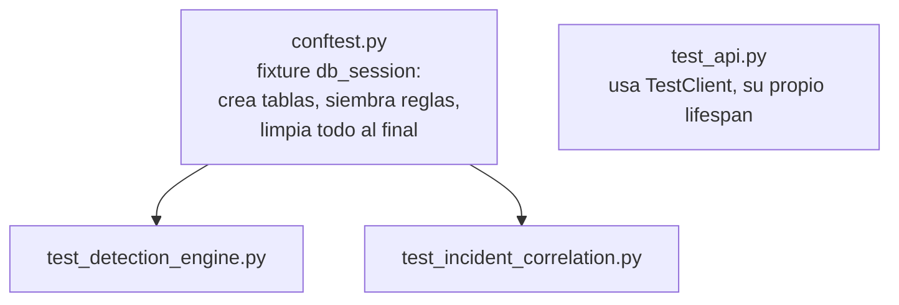

# 09 — Tests

## Cómo ejecutarlos
```bash
cd backend
pip install -r requirements.txt --break-system-packages   # o dentro de un venv
pytest -v
```

Los tests usan una base de datos PostgreSQL real (no SQLite), definida
por `DATABASE_URL` en `tests/conftest.py` (por defecto apunta a
`gravity_siem_test` en `localhost:5432`). Si tienes el stack de Docker
Compose levantado, expón temporalmente el puerto de Postgres o crea la
base `gravity_siem_test` manualmente:

```bash
docker compose exec postgres psql -U gravity -c "CREATE DATABASE gravity_siem_test;"
```

## Qué cubre cada archivo


### `test_detection_engine.py`
| Test | Qué verifica |
|---|---|
| `test_no_alert_below_threshold` | 5 eventos (< umbral 10) no generan alerta |
| `test_alert_fires_at_threshold` | El evento 10 dispara exactamente 1 alerta `RULE-001` / `HIGH` / `T1110` |
| `test_alert_does_not_duplicate_within_window` | Un 11º evento en la misma ventana no genera una segunda alerta (cooldown) |
| `test_events_outside_window_do_not_count` | Eventos fuera de la ventana temporal no cuentan para el umbral |
| `test_different_source_ips_tracked_independently` | Dos IPs con 9 eventos cada una (ninguna llega a 10) no disparan alerta — el conteo es por IP, no global |

### `test_incident_correlation.py`
| Test | Qué verifica |
|---|---|
| `test_first_alert_creates_incident` | La primera alerta de una IP+técnica crea un incidente nuevo |
| `test_second_matching_alert_joins_same_incident` | Una segunda alerta con la misma IP+técnica se une al incidente existente (`alert_count` sube a 2) |
| `test_different_source_ip_creates_new_incident` | Una alerta de una IP distinta crea un incidente separado |

### `test_api.py`
Tests de integración con `TestClient` de FastAPI (dispara el
`lifespan` real, incluyendo el seed):

| Test | Qué verifica |
|---|---|
| `test_health_check` | `GET /api/health` responde `200` con `status: ok` |
| `test_rules_are_seeded` | `GET /api/rules` devuelve las 7 reglas, incluyendo `RULE-001` |
| `test_simulator_triggers_events` | `POST /api/simulator/malware` devuelve `events_queued: 1` y confirma en el mensaje que es una simulación |

## Filosofía de testing de este proyecto
Se ha evitado deliberadamente escribir tests que no comprueben nada
real (p. ej. "el endpoint devuelve 200" sin verificar el contenido).
Cada test de `detection_engine` y `incident_correlation` verifica un
comportamiento de negocio concreto: umbral, ventana temporal,
aislamiento por IP, y anti-duplicados — las cuatro propiedades que
hacen que el motor de detección sea correcto y no un simple contador.