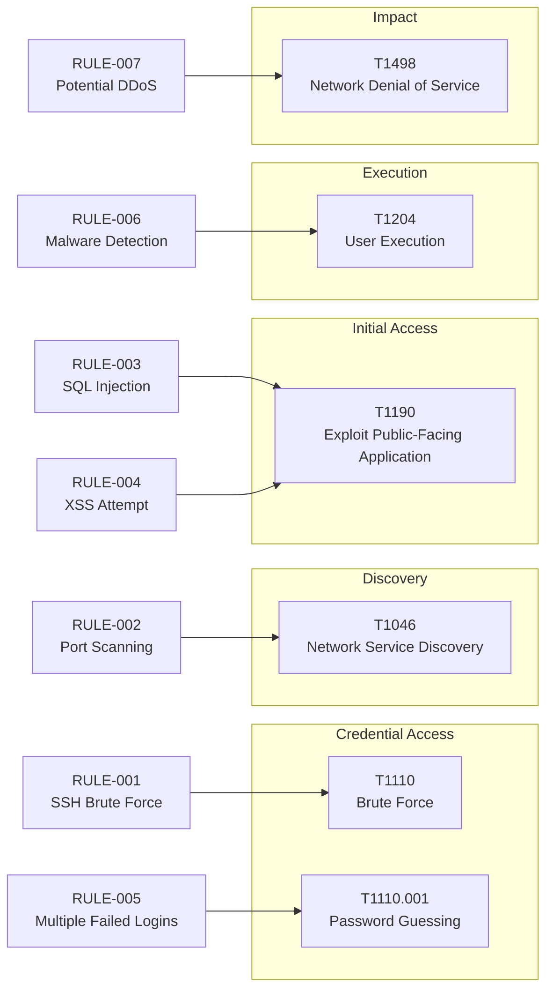

# 10 — Mapeo MITRE ATT&CK
Gravity SIEM etiqueta cada regla de detección con una táctica y
técnica de [MITRE ATT&CK](https://attack.mitre.org/), el framework de
referencia de la industria para clasificar comportamientos
adversarios. Los datos se almacenan localmente (columnas
`mitre_tactic` / `mitre_technique` / `mitre_technique_name` en
`detection_rules`) — no se llama a ninguna API externa.

## Técnicas cubiertas

## Tabla de referencia
| Técnica | Nombre | Táctica | Regla(s) que la usan | Enlace oficial |
|---|---|---|---|---|
| T1110 | Brute Force | Credential Access | RULE-001 | [attack.mitre.org/techniques/T1110](https://attack.mitre.org/techniques/T1110/) |
| T1110.001 | Password Guessing | Credential Access | RULE-005 | [attack.mitre.org/techniques/T1110/001](https://attack.mitre.org/techniques/T1110/001/) |
| T1046 | Network Service Discovery | Discovery | RULE-002 | [attack.mitre.org/techniques/T1046](https://attack.mitre.org/techniques/T1046/) |
| T1190 | Exploit Public-Facing Application | Initial Access | RULE-003, RULE-004 | [attack.mitre.org/techniques/T1190](https://attack.mitre.org/techniques/T1190/) |
| T1204 | User Execution | Execution | RULE-006 | [attack.mitre.org/techniques/T1204](https://attack.mitre.org/techniques/T1204/) |
| T1498 | Network Denial of Service | Impact | RULE-007 | [attack.mitre.org/techniques/T1498](https://attack.mitre.org/techniques/T1498/) |

## Nota sobre XSS y T1190
XSS no tiene una técnica MITRE dedicada de forma directa (XSS es un
mecanismo de explotación web, no una táctica por sí misma en el
framework Enterprise). Se ha mapeado a **T1190 — Exploit
Public-Facing Application**, la técnica que MITRE usa para cualquier
explotación de una aplicación expuesta públicamente, que es la
categoría a la que pertenece un ataque XSS reflejado o almacenado
contra una app web. Esta elección se documenta aquí explícitamente
para que quede claro que es una decisión de mapeo razonada, no un
error.

## Cómo se expone en la API y el frontend
- `GET /api/mitre` devuelve una entrada por técnica única, con el
  conteo de alertas reales generadas para ella — ver
  [06-api-reference.md](./06-api-reference.md).
- La página `/mitre` del frontend renderiza una tarjeta por técnica.
- Cada alerta individual (`GET /api/alerts`) incluye `mitre_tactic` y
  `mitre_technique`, visibles en las páginas Alerts e Incident Detail.