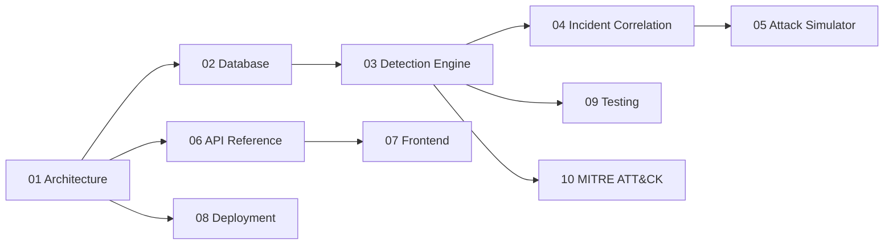

# Gravity SIEM — Documentación
Documentación técnica completa del proyecto, dividida por tema. El
`README.md` de la raíz se mantiene como resumen rápido de arranque;
esta carpeta es la referencia detallada.

| Documento | Contenido |
|---|---|
| [01-architecture.md](./01-architecture.md) | Visión general, diagrama de arquitectura, flujo de datos end-to-end |
| [02-database.md](./02-database.md) | Esquema de PostgreSQL, diagrama ER, índices, migraciones |
| [03-detection-engine.md](./03-detection-engine.md) | Cómo funciona el motor de reglas, catálogo de reglas, diagrama de secuencia |
| [04-incident-correlation.md](./04-incident-correlation.md) | Lógica de correlación de alertas en incidentes |
| [05-attack-simulator.md](./05-attack-simulator.md) | Cómo funciona cada ataque simulado, garantías de seguridad |
| [06-api-reference.md](./06-api-reference.md) | Referencia completa de endpoints REST y WebSocket |
| [07-frontend.md](./07-frontend.md) | Estructura del frontend, páginas, diseño, capa de API |
| [08-deployment.md](./08-deployment.md) | Docker Compose, variables de entorno, despliegue futuro en GitHub Pages |
| [09-testing.md](./09-testing.md) | Estrategia de tests, cómo ejecutarlos |
| [10-mitre-attck.md](./10-mitre-attck.md) | Mapeo de técnicas MITRE ATT&CK usadas |

## Orden de lectura recomendado

Si solo quieres arrancar el proyecto, ve directamente al
[README.md](../README.md) de la raíz o a
[08-deployment.md](./08-deployment.md).